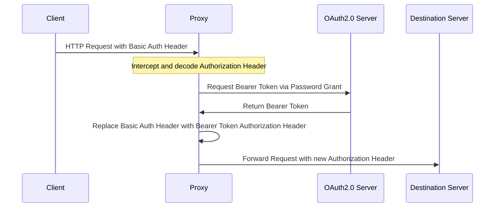

# Basic Auth to OAuth2.0 Transformer


This proxy intercepts Authorization headers containing base64-encoded credentials. When it detects an Authorization Header with Basic Authentication credentials, it extracts the credentials and uses them to request a Bearer token through a Password Grant flow from the specified OAuth2.0 server. Upon successful authorization, the proxy replaces the Basic Authentication header with an Authorization header that includes the Bearer token. To enhance performance and reduce the load on the OAuth2.0 server, caching of the Bearer token can be enabled. This optional feature allows the token to be stored either in an in-memory cache or an external Redis cache.

## Use Case

Oh, the joys of modern technology—why on Earth wouldn't everyone just use a client that supports OAuth2.0, right? Alas, in the real world, you're at the mercy of customers who take their sweet time updating their systems. So, while you wait for them to join us in the 21st century, you're stuck supporting Basic Auth due to SLAs and the glacial pace of support updates. This proxy is your knight in shining armor, letting you fully embrace OAuth2.0 while also catering to the antiquated needs of Basic Auth for a bit longer. Just remember, Basic Auth is about as secure as leaving your keys in the door, so avoid it like your tech-savvy reputation depends on it!


## Sequence Diagram



## Getting Started

Follow these instructions to set up the Basic Auth to OAuth2.0 Transformer for development and testing.

### Prerequisites

- Go
- Docker
- Docker Compose

### Installing

Clone the repository:
```bash
git clone https://github.com/nickhartjes/BasicAuthProxyTransformer.git
cd BasicAuthProxyTransformer
```
Build the application:
```bash
make build
```
Build the Docker image:
```bash
make docker-build
```
Start the Docker Compose services:
```bash
make docker-up
```

## Running the tests

Execute the tests:
```bash
make test
```
Generate a test coverage report:
```bash
make cover
```

## Built With
- [Go](https://golang.org/)
- [Docker](https://www.docker.com/)
- [Docker Compose](https://docs.docker.com/compose/)

## Authors

- Nick Hartjes <nick@hartj.es>

## License

This project is licensed under the MIT License. See the [LICENSE.md](LICENSE.md) file for details.
