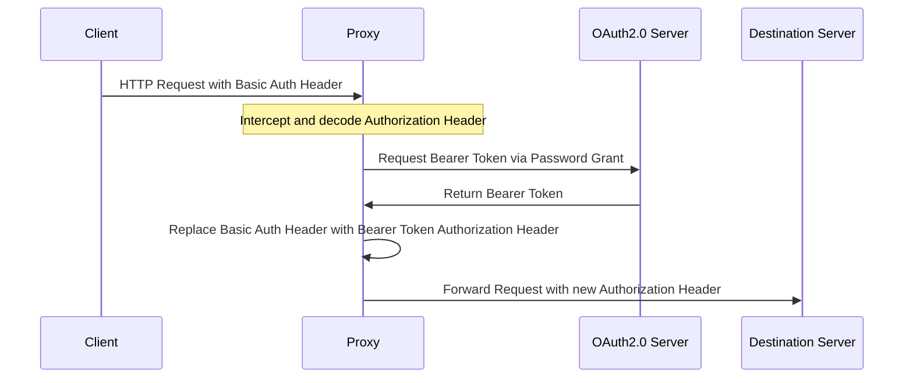

# Basic Auth to OAuth2.0 Transformer


This proxy intercepts Authorization headers containing base64-encoded credentials. When it detects an Authorization Header with Basic Authentication credentials, it extracts the credentials and uses them to request a Bearer token through a Password Grant flow from the specified OAuth2.0 server. Upon successful authorization, the proxy replaces the Basic Authentication header with an Authorization header that includes the Bearer token. To enhance performance and reduce the load on the OAuth2.0 server, caching of the Bearer token can be enabled. This optional feature allows the token to be stored either in an in-memory cache or an external Redis cache.

## Use Case

Oh, the joys of modern technology—why on Earth wouldn't everyone just use a client that supports OAuth2.0, right? Alas, in the real world, you're at the mercy of customers who take their sweet time updating their systems. So, while you wait for them to join us in the 21st century, you're stuck supporting Basic Auth due to SLAs and the glacial pace of support updates. This proxy is your knight in shining armor, letting you fully embrace OAuth2.0 while also catering to the antiquated needs of Basic Auth for a bit longer. Just remember, Basic Auth is about as secure as leaving your keys in the door, so avoid it like your tech-savvy reputation depends on it!


## Sequence Diagram



## Configuration Guide

This guide explains how to configure the application using a `config.toml` file and environment variables.

### `config.toml`

The `config.toml` file is a configuration file in TOML format. Here's an example:

```toml
port = "8080"
debug = false
target_header_name = "X-Target-URL"

[cache]
enabled = false
cache_type = "ristretto"

[cache.ristretto]
num_counters = 1000
max_cost = 100
buffer_items = 64

[cache.redis]
host = "http://localhost"
port = 6379
password = ""
database = 0

[oauth2]
host = "http://localhost"
port = 8090
token_endpoint = "/realms/example/protocol/openid-connect/token"
client_id = "my-client"
client_secret = "my-client-secret"
```

### Environment Variables
You can also configure the application using environment variables. The following table lists the available environment variables, their descriptions, and their default values:  
Environment Variable
D

| Environment Variable | Description                                        | Default Value                         |
| --- |----------------------------------------------------|---------------------------------------|
| `PORT` | The port the application listens on                | `"8080"`                              |
| `DEBUG` | Enable or disable debug mode                       | `false`                               |
| `TARGET_HEADER_NAME` | The name of the target header                      | `"X-Target-URL"`                      |
| `CACHE_ENABLED` | Enable or disable the cache                        | `false`                               |
| `CACHE_CACHE_TYPE` | The type of cache to use `"ristretto"` or `"redis"`                          | `"ristretto"`                         |
| `CACHE_RISTRETTO_NUM_COUNTERS` | The number of counters for the Ristretto cache     | `1000`                                |
| `CACHE_RISTRETTO_MAX_COST` | The maximum cost for the Ristretto cache           | `100`                                 |
| `CACHE_RISTRETTO_BUFFER_ITEMS` | The number of buffer items for the Ristretto cache | `64`                                  |
| `CACHE_REDIS_HOST` | The host of the Redis server                       | `"http://localhost"`                  |
| `CACHE_REDIS_PORT` | The port of the Redis server                       | `6379`                                |
| `CACHE_REDIS_PASSWORD` | The password for the Redis server                  | `""`                                  |
| `CACHE_REDIS_DATABASE` | The database number for the Redis server           | `0`                                   |
| `OAUTH2_HOST` | The host of the OAuth2 server                      | `"http://localhost"`                  |
| `OAUTH2_PORT` | The port of the OAuth2 server                      | `8090`                                |
| `OAUTH2_TOKEN_ENDPOINT` | The token endpoint of the OAuth2 server            | `"/realms/example/protocol/openid-connect/token"` |
| `OAUTH2_CLIENT_ID` | The client ID for the OAuth2 server                | `"my-client"`                         |
| `OAUTH2_CLIENT_SECRET` | The client secret for the OAuth2 server            | `"my-client-secret"`                  |

Please note that the environment variables are case sensitive and should be in uppercase. The nested settings are separated by underscores.

## Development and Testing

Follow these instructions to set up the Basic Auth to OAuth2.0 Transformer for development and testing.

### Prerequisites

- Go
- Docker
- Docker Compose

### Building and Running
Build the application:
```bash
make build
```
Build the Docker image:
```bash
make docker-build
```
Start the Docker Compose services:
```bash
make docker-up
```

## Running the tests

Execute the tests:
```bash
make test
```
Generate a test coverage report:
```bash
make cover
```

## Built With
- [Go](https://golang.org/)
- [Docker](https://www.docker.com/)
- [Docker Compose](https://docs.docker.com/compose/)

## Authors

- Nick Hartjes <nick@hartj.es>

## License

This project is licensed under the MIT License. See the [LICENSE.md](LICENSE.md) file for details.
